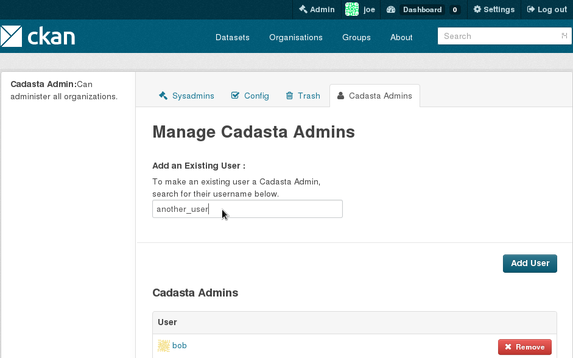

.. ckanext-cadastaroles documentation master file, created by
   sphinx-quickstart on Tue Sep 29 02:10:21 2015.
   You can adapt this file completely to your liking, but it should at least
   contain the root `toctree` directive.

ckanext-cadastaroles documentation
==================================

Extended Permissions
--------------------
The standard CKAN permissions have been expanded

* read (dataset)
* delete_dataset
* create_dataset
* update_dataset
* manage_group
* read_cadasta_resource
* create_cadasta_resource
* update_cadasta_resource
* delete_cadasta_resource
* read_survey
* create_survey
* update_survey
* delete_survey
* read_parcel
* create_parcel
* update_parcel
* delete_parcel
* read_relationship
* create_relationship
* update_relationship
* delete_relationship

These permissions are checked by the ckan authorization functions, see
**Action functions and authorization functions** in the ckan documentation
http://docs.ckan.org/en/latest/extensions/tutorial.html#implementing-the-iauthfunctions-plugin-interface

Extended Roles
--------------
The standard CKAN roles have been extended to make use of the extended
permissions. The roles below all correspond to users inside and organization

======================= ========= ============== =============== =====
Permission              Surveryor Community User Community Admin Admin
======================= ========= ============== =============== =====
read (dataset)          yes       yes            yes             yes
delete_dataset          no        no             yes             yes          
create_dataset          no        yes            no              yes
update_dataset          no        yes            yes             yes
manage_group            no        no             yes             yes
read_cadasta_resource   no        yes            yes             yes
create_cadasta_resource no        yes            yes             yes
update_cadasta_resource no        yes            yes             yes 
delete_cadasta_resource no        yes            yes             yes
read_survey             yes       yes            yes             yes
create_survey           yes       no             yes             yes
update_survey           yes       no             yes             yes
delete_survey           yes       no             yes             yes
read_parcel             yes       yes            yes             yes
create_parcel           yes       no             yes             yes
update_parcel           yes       no             yes             yes
delete_parcel           yes       no             yes             yes
read_relationship       yes       yes            yes             yes
create_relationship     yes       no             yes             yes    
update_relationship     yes       no             yes             yes 
delete_relationship     yes       no             yes             yes
======================= ========= ============== =============== =====

Cadasta Admins
--------------
An additional user type, the Cadasta admin has administrative permission over
all organizations, these users can only be assigned by system administrators.
These can be assigned in the CKAN administration tab.

Action API Reference
--------------------

The action functions added by ckanext-cadastaroles are an extension of the
CKAN API, for details on api example api usage, see
http://docs.ckan.org/en/latest/api/index.html

.. automodule:: ckanext.cadastaroles.logic.action
   :members:

Indices and tables
==================

* :ref:`genindex`
* :ref:`modindex`
* :ref:`search`

